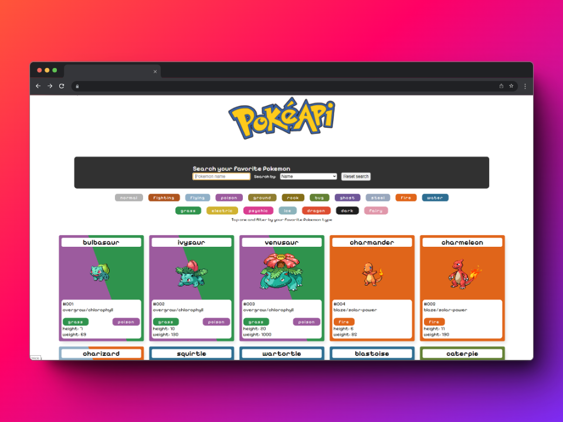

# PokeApi - Prueba Técnica

## Requisitos para ejecutar el proyecto

- Tener en tu sistema [NodeJS](https://nodejs.org/en) v20+
- Clonar este repositorio
```shell
git clone https://github.com/Gonzalo-Erceg/PokeApi-Prueba.git
```
- instalar todas las dependencias usando npm (ya debería estar instalado luego de instalar NodeJS )
```shell
npm install
```
- Una vez con todas las dependencias instaladas se ejecutara la App de electron.

```shell
npm run dev
```



